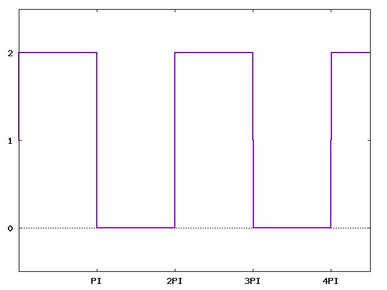

# fourier {#mainpage}
> Showcase implementation of the several fourier transformation algorithms as discused on [thoughts-on-cpp.com](https://thoughts-on-cpp.com/..)

[![CircleCI][circleci-badge]][circleci-url]
[![CodeFactor Grade][codefactor-badge]][codefactor-url]
[![Documentation][documentation-badge]][documentation-url]
[![License][license-badge]][license-url]

An example implementation of several fourier transformation algorithms:
- Direct Fourier Transformation (DFT)

## Getting Started

To build the project:
- Setup toolchain `~/fourier/build/cmake .. -DCMAKE_TOOLCHAIN_FILE={YOUR_PATH_TO_VCPKG}/scripts/buildsystems/vcpkg.cmake`
- Build `~/fourier/build/cmake --build . --config Release`
- Execute the tests `~/fourier/build/ctest`
- You can execute the program by `./build/app/fourier`

### Prerequisites/Dependencies

- [cmake][cmake-url] – Open-Source, cross-platform build tool
- [fmt][fmt-url] – External library used for formatting and printing results
- [doctest][doctest-url] – Feature-rich C++11/14/17/20 single-header testing framework for unit tests and TDD
- [vcpkg][vcpkg-url] – C++ Library Manager for Windows, Linux, and MacOS
- [python 3][python-url] – A programming language used to convert ctest results with a xml transformation (xslt)

## Release History

* [0.1.0][v0.1.0]
    * ADD: Direct Fourier Transformation (DFT)
    * ADD: Fourier test data

## Meta

**Benjamin Mahr** – [GitHub][rep-url]  
&nbsp;&nbsp;&nbsp;&nbsp;&nbsp;&nbsp;&nbsp;&nbsp;&nbsp;&nbsp;&nbsp;&nbsp;&nbsp;&nbsp;&nbsp;&nbsp;&nbsp;&nbsp;&nbsp;&nbsp;&nbsp;&nbsp;&nbsp;&nbsp;&nbsp;&nbsp;– [LinkedIn][linkedin-url]  
&nbsp;&nbsp;&nbsp;&nbsp;&nbsp;&nbsp;&nbsp;&nbsp;&nbsp;&nbsp;&nbsp;&nbsp;&nbsp;&nbsp;&nbsp;&nbsp;&nbsp;&nbsp;&nbsp;&nbsp;&nbsp;&nbsp;&nbsp;&nbsp;&nbsp;&nbsp;– [Twitter][twitter-url]  
&nbsp;&nbsp;&nbsp;&nbsp;&nbsp;&nbsp;&nbsp;&nbsp;&nbsp;&nbsp;&nbsp;&nbsp;&nbsp;&nbsp;&nbsp;&nbsp;&nbsp;&nbsp;&nbsp;&nbsp;&nbsp;&nbsp;&nbsp;&nbsp;&nbsp;&nbsp;– [Mail][mail]

Distributed under the MIT license. See ``LICENSE`` for more information.

## Contributing

1. Fork it (<https://github.com/Ben1980/fourier/fork>)
2. Create your feature branch (`git checkout -b feature/fooBar`)
3. Commit your changes (`git commit -am 'Add some fooBar'`)
4. Push to the branch (`git push origin feature/fooBar`)
5. Create a new Pull Request

## Acknowledgments

- Converting CTest results int JUnit XML – https://stackoverflow.com/a/21688776/1541782
- README.md template inspiration – https://github.com/dbader/readme-template
- Doxygen GitHub-Action – https://github.com/mattnotmitt/doxygen-action
- gh-pages GitHub-Action – https://github.com/peaceiris/actions-gh-pages
- Dockerfile Tips – https://blog.container-solutions.com/6-dockerfile-tips-official-images

[circleci-url]: https://circleci.com/gh/Ben1980/fourier
[codefactor-url]: https://www.codefactor.io/repository/github/ben1980/fourier
[documentation-url]: https://ben1980.github.io/fourier/
[license-url]: https://github.com/Ben1980/fourier/blob/master/LICENSE
[circleci-badge]: https://img.shields.io/circleci/build/gh/Ben1980/fourier
[codefactor-badge]: https://img.shields.io/codefactor/grade/github/ben1980/fourier
[documentation-badge]: https://img.shields.io/github/workflow/status/Ben1980/fourier/Documentation?label=Documentation
[license-badge]: https://img.shields.io/github/license/Ben1980/fourier
[cmake-url]: https://cmake.org/
[fmt-url]: https://fmt.dev/latest/index.html
[doctest-url]: https://github.com/onqtam/doctest
[rep-url]: https://github.com/Ben1980
[linkedin-url]: https://www.linkedin.com/in/benjamin-mahr-728a1639/
[twitter-url]: https://twitter.com/BenMahr
[mail]: ben.amhr@gmail.com
[vcpkg-url]: https://github.com/microsoft/vcpkg
[python-url]: https://www.python.org/

[v0.1.0]: https://github.com/Ben1980/fourier/releases/tag/v0.1.0
